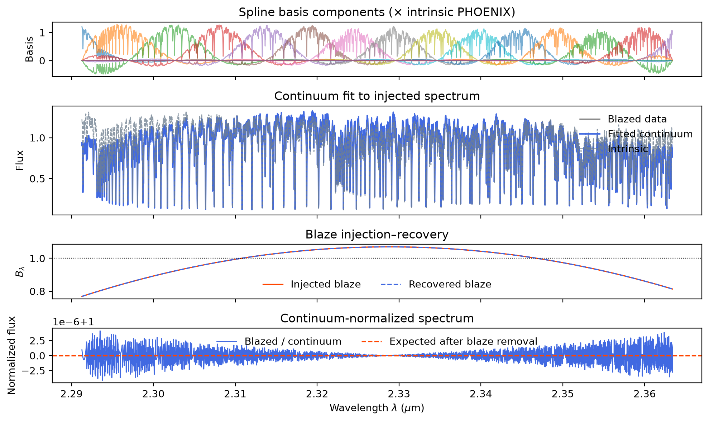
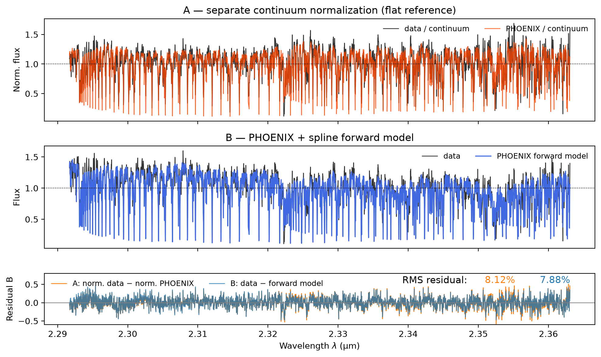
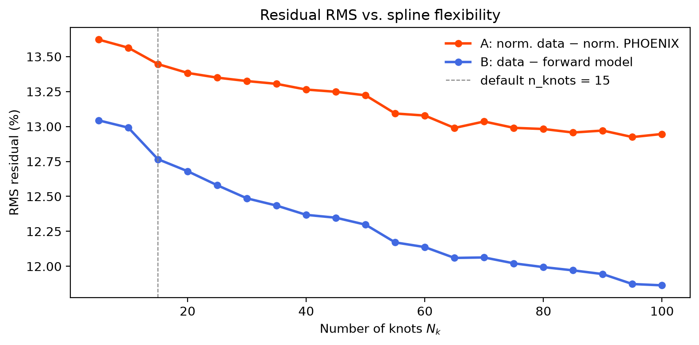
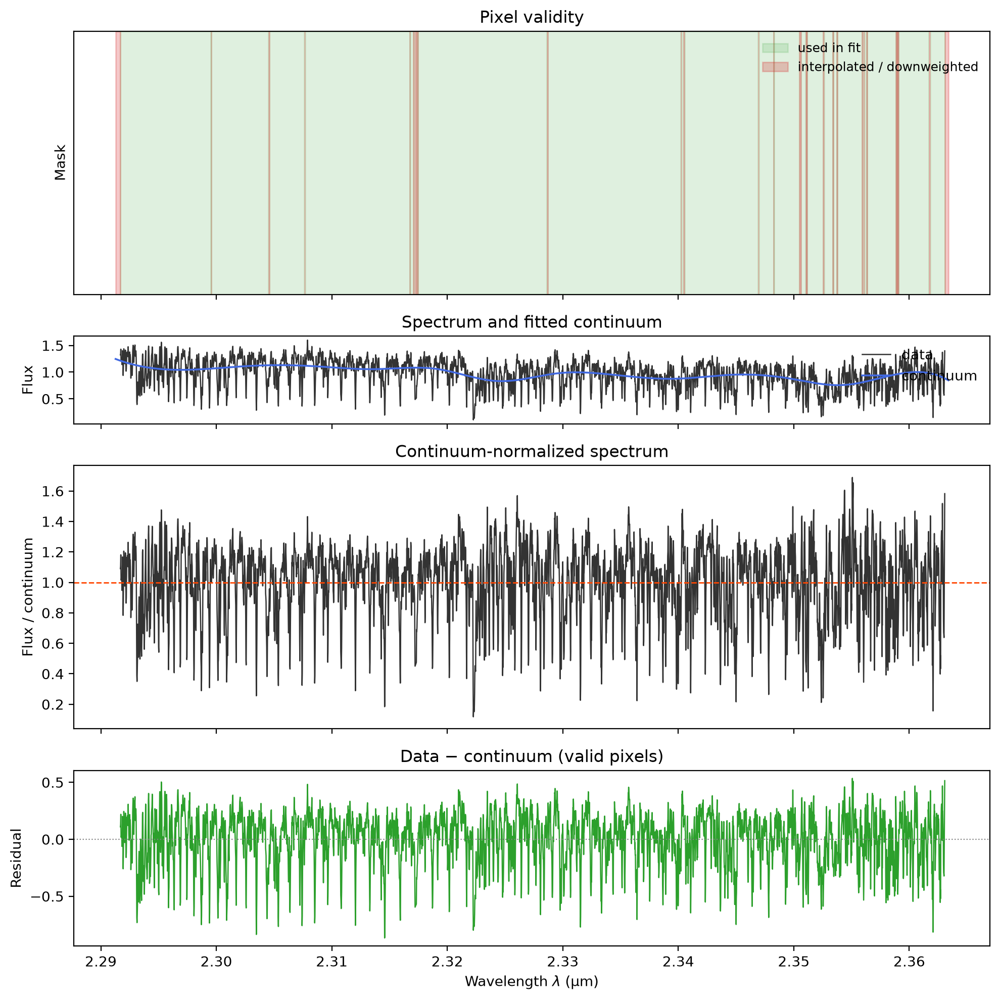

Examples
========

Notebooks
---------

The following notebooks demonstrate ``splinenorm`` on bundled example data
(``docs/data/``):

* :download:`Getting_Started.ipynb` — continuum removal with a flat reference spectrum.
* :download:`Fit_Continuum.ipynb` — comparing flat vs. PHOENIX-template continuum strategies on M-dwarf data.
* :download:`Fit_Fringing.ipynb` — IFU fringing simulation and companion recovery in high-contrast spectroscopy.

Run locally after ``pip install -e ".[dev]"`` and ``pip install matplotlib ipython jupyter``.

Diagnostic figures
------------------

Continuum removal (Getting Started):

Flat vs. PHOENIX continuum fit (Fit Continuum):

Fringing recovery (Fit Fringing):

Command-line demo
-----------------

``docs/high_contrast_specroscopy_speckles.py`` reproduces the fringing notebook
as a script. It reads pre-exported PHOENIX text spectra from ``docs/data/``.
